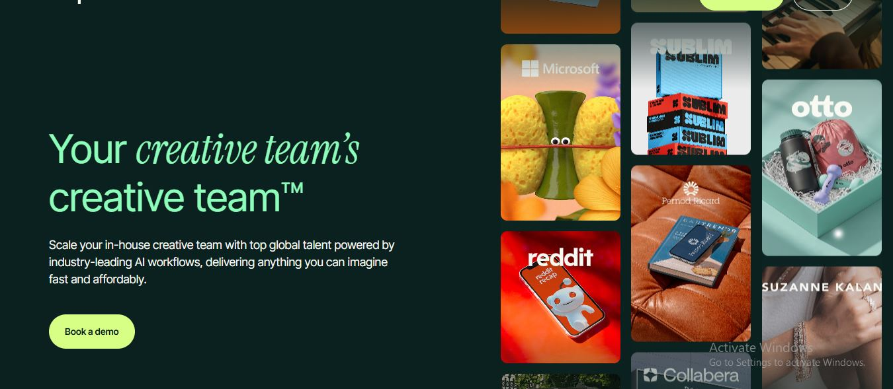

# Pixel2Tech - AI-Powered Creative Agency Website

A modern, premium, and fully responsive website for an AI-powered creative agency. Built with Next.js 16, React 19, Tailwind CSS 4, and Framer Motion, featuring stunning animations, custom cursor interactions, and an immersive portfolio showcase.



## 🌟 Features

### Global Header
- **Scroll Detection**: Intersection Observer for "Brands That Trust Pixel2Tech" section
- **Glassmorphism**: Blurred background with semi-transparent container
- **Desktop Navigation**: Center-aligned with animated underline on hover
- **Mobile Navigation**: Full-height slide-in panel with stagger animations
- **Theme Toggle**: Light/Dark mode with smooth icon rotation
- **Sticky Behavior**: Becomes sticky after scroll with smooth fade-in
- **Active Section Highlighting**: Auto-detects and highlights current section

### Hero Section
- **Two-Column Layout**: Content on the left, animated portfolio marquee on the right
- **Vertical 3-Sided Marquee** (Desktop): Three columns with alternating scroll directions (up/down/up)
- **Two-Row Horizontal Marquee** (Mobile/Tablet): Top row scrolls left, bottom row scrolls right
- **Custom Cursor**: Context-aware blurred cursor with dynamic text ("Expand+", "Close", "Book Call", etc.)
- **Full-Screen Project Overlay**: Immersive project details with blurred background, 4-image grid, and stats
- **Smooth Animations**: Powered by Framer Motion for all transitions and hover effects
- **Gradient Background**: Premium blue-themed gradient with decorative blur orbs
- **Trust Indicators**: Animated avatars with "Trusted by 100+ founders" message

### Additional Sections
- **About Section**: Company introduction and value proposition
- **Brand Ticker**: Animated logo showcase of trusted brands
- **Work Marquee**: Portfolio showcase with infinite scroll
- **Process Section**: Step-by-step workflow explanation
- **Testimonials**: Client feedback and success stories
- **Services**: Comprehensive service offerings
- **Team Section**: Team member showcase
- **Blog Section**: Latest articles and insights
- **Contact Section**: Easy-to-use contact form
- **CTA Section**: Final call-to-action

## 🛠️ Tech Stack

| Category | Technology | Version |
|----------|-----------|---------|
| **Framework** | [Next.js](https://nextjs.org/) | 16.1.6 |
| **UI Library** | [React](https://react.dev/) | 19.2.3 |
| **Styling** | [Tailwind CSS](https://tailwindcss.com/) | 4.x |
| **Animations** | [Framer Motion](https://www.framer.com/motion/) | 12.34.3 |
| **Icons** | [Lucide React](https://lucide.dev/) | 0.575.0 |
| **Marquee** | React Fast Marquee | 1.6.5 |
| **Cursor** | React Animated Cursor | 2.11.2 |
| **Build Tool** | Turbopack | Built-in |
| **Linting** | ESLint | 9.x |

## 📁 Project Structure

```
pixel2tech/
├── app/
│   ├── components/
│   │   ├── Layout/
│   │   │   ├── Header/
│   │   │   │   ├── index.jsx          # Global header with scroll detection
│   │   │   │   ├── index.js           # Barrel export
│   │   │   │   └── README.md          # Header documentation
│   │   │   └── footer.jsx             # Global footer
│   │   ├── HeroSection.jsx            # Premium hero with marquee & overlay
│   │   ├── aboutSection.jsx           # About section component
│   │   ├── BrandTicker.jsx            # Brand logo ticker
│   │   ├── WorkMarquee.jsx            # Portfolio marquee
│   │   ├── process.jsx                # Process/workflow section
│   │   ├── testimonials.jsx           # Client testimonials
│   │   ├── services.jsx               # Services showcase
│   │   ├── TeamSection.jsx            # Team members
│   │   ├── BlogSection.jsx            # Blog posts
│   │   ├── contact.jsx                # Contact form
│   │   └── ctasection.jsx             # Call-to-action
│   ├── about/
│   ├── blogs/
│   ├── contact/
│   ├── portfolio/
│   ├── services/
│   ├── data/
│   ├── globals.css                    # Global styles & custom utilities
│   ├── layout.js                      # Root layout with Header
│   └── page.js                        # Home page
├── public/
│   └── images/                        # All image assets
├── package.json
├── next.config.mjs
├── tailwind.config.mjs
├── postcss.config.mjs
├── jsconfig.json
└── README.md
```

## 🚀 Getting Started

### Prerequisites

- Node.js 18.17 or later
- npm or yarn

### Installation

1. **Clone the repository** (or navigate to the project directory)

2. **Install dependencies**
   ```bash
   npm install
   ```

3. **Run the development server**
   ```bash
   npm run dev
   ```

4. **Open your browser**
   Navigate to [http://localhost:3000](http://localhost:3000)

### Build for Production

```bash
npm run build
npm start
```

## 🎨 Design Highlights

### Color Palette
- **Primary**: Blue gradient (`from-blue-600 to-cyan-600`)
- **Background**: Slate dark gradients (`slate-950`, `slate-900`)
- **Accent**: Purple, green, and cyan highlights
- **Text**: White and slate variants for hierarchy

### Typography
- Clean, modern sans-serif fonts
- Responsive sizing (text-4xl to text-7xl for headings)
- Tight leading for impactful headlines

### Animations
- **Marquee Scroll**: Smooth infinite loop (30s duration)
- **Hover Effects**: Scale (1.05), translateY (-5px)
- **Overlay**: Fade in/out with slide animation
- **Custom Cursor**: Smooth follow with 0.15s transition

## 🎯 Key Components

### Header
The flagship navigation component featuring:
- Intersection Observer scroll detection
- Glassmorphism container with backdrop blur
- Desktop nav with animated underline (Framer Motion)
- Mobile slide-in panel with spring animation
- Theme toggle with rotating icons
- Active section highlighting
- Sticky behavior with smooth transitions

### HeroSection
The flagship component featuring:
- Responsive two-column layout
- Animated portfolio marquee (3 vertical columns on desktop, 2 horizontal rows on mobile)
- Custom cursor with context-aware text
- Full-screen project overlay with detailed view
- Gradient backgrounds and decorative elements

### ProjectOverlay
Full-screen modal displaying:
- Project category badge
- Large project title
- 4-image grid gallery
- Project description
- Performance stats (Satisfaction, Delivery, Rating, Support)
- Call-to-action buttons

### Marquee Components
- `VerticalMarqueeColumn`: Vertical scroll for desktop
- `TwoRowHorizontalMarquee`: Dual-row horizontal scroll for mobile
- `MarqueeItem`: Individual portfolio card with hover effects

## 📱 Responsive Breakpoints

| Breakpoint | Width | Layout Changes |
|------------|-------|----------------|
| Mobile | < 640px | Single column, 2-row marquee (smaller cards) |
| Tablet | 640px - 1023px | 2-row marquee (medium cards) |
| Desktop | ≥ 1024px | Two columns, 3-column vertical marquee |

## ⚡ Performance Optimizations

- **Static Generation**: All pages pre-rendered as static content
- **Image Optimization**: Next.js Image component for optimized loading
- **CSS Purging**: Tailwind automatically removes unused styles
- **Code Splitting**: Automatic per-page code splitting
- **GPU Acceleration**: `will-change-transform` for smooth animations

## 🎭 Custom Cursor System

The custom cursor changes based on context:

| Context | Cursor Text |
|---------|-------------|
| Hovering marquee item | "Expand+" |
| Hovering overlay close | "Close" |
| Hovering primary CTA | "Book Call" |
| Hovering secondary CTA | "View Work" |
| Default | Hidden |

## 📊 Browser Support

| Browser | Version |
|---------|---------|
| Chrome | Latest |
| Firefox | Latest |
| Safari | Latest |
| Edge | Latest |

## 🔧 Available Scripts

```bash
npm run dev      # Start development server
npm run build    # Build for production
npm start        # Start production server
npm run lint     # Run ESLint
```

## 📄 Project Highlights

- ✅ **Fully Responsive**: Mobile-first design approach
- ✅ **Accessible**: ARIA labels and semantic HTML
- ✅ **Performance Optimized**: Static generation and lazy loading
- ✅ **SEO Ready**: Proper meta tags and structured data
- ✅ **Modern UI/UX**: Premium design with smooth interactions
- ✅ **Scalable Code**: Clean component architecture
- ✅ **Type Safe**: JavaScript with JSDoc comments

## 🎨 Inspiration

This project draws inspiration from:
- [Superside](https://www.superside.com) - Hero section marquee and layout
- Premium AI agency websites
- Modern SaaS landing pages

## 📝 License

This project is proprietary and confidential. All rights reserved.

## 👨‍💻 Author

**Pixel2Tech Team**

- Location: Pakistan
- Working with clients worldwide
- Specializing in: Branding, Web Design, UI/UX, AI-Powered Creative

## 📞 Contact

- **Website**: [Your Website URL]
- **Email**: [Your Email]
- **Location**: Pakistan

---

##  Acknowledgments

- [Next.js Team](https://nextjs.org/) for the amazing framework
- [Tailwind CSS](https://tailwindcss.com/) for the utility-first CSS framework
- [Framer Motion](https://www.framer.com/motion/) for smooth animations
- [Lucide Icons](https://lucide.dev/) for beautiful icon set

---

**Built with ❤️ by Pixel2Tech**

*Leading AI Powered Creative Agency for the Modern Era*
